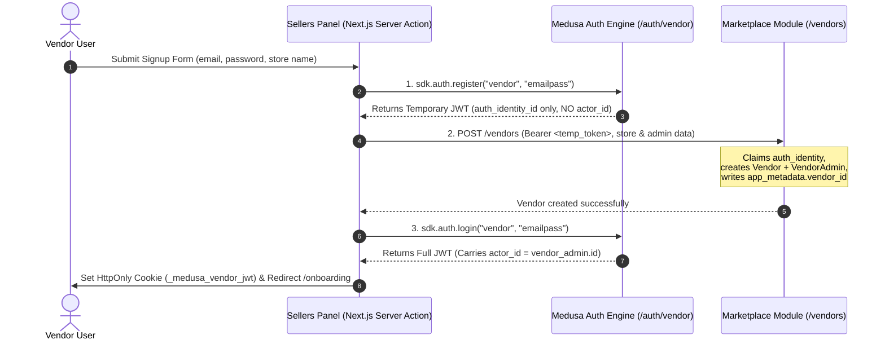

# Sellers Panel of Medusa: Complete Architecture, Routes & Vendor Data Layer Manual

> **Document Status**: Production-Ready Architectural Reference  
> **Framework**: Next.js 15 (App Router with Server Actions & Client-Side Interactive DataTables)  
> **Runtime & UI**: React 19 + `@tanstack/react-query` + `@medusajs/ui` (Design System) + Tailwind CSS  
> **SDK & Models**: `@medusajs/js-sdk`, `@medusajs/types`  
> **Local Port**: `7000` / `7001` (Direct URL: `http://localhost:7000`)  
> **Target Audience**: Mobile App Developers, Multi-Vendor Frontend Engineers, Backend Integrators

---

## Table of Contents
1. [Architecture & Multi-Tenant Isolation](#1-architecture--multi-tenant-isolation)
2. [3-Phase Authentication & MFA Security Pipeline](#2-3-phase-authentication--mfa-security-pipeline)
3. [Same-Origin Reverse Proxy Layer](#3-same-origin-reverse-proxy-layer)
4. [Dynamic Feature Access & Capability Matrix](#4-dynamic-feature-access--capability-matrix)
5. [TrustClaw Master Catalog & Taxonomy Synchronization](#5-trustclaw-master-catalog--taxonomy-synchronization)
6. [Exhaustive Route & Page Catalog (All 67 Pages)](#6-exhaustive-route--page-catalog-all-67-pages)
7. [Exhaustive Vendor Data Layer Catalog (110+ Functions)](#7-exhaustive-vendor-data-layer-catalog-110-functions)
8. [Multi-Tenant Isolation Invariants & Security Mandates](#8-multi-tenant-isolation-invariants--security-mandates)
9. [Environment Configuration & Deployment Runbook](#9-environment-configuration--deployment-runbook)

---

## 1. Architecture & Multi-Tenant Isolation

The **Sellers Panel** (`sellers/`) is an enterprise-grade multi-tenant merchant portal designed specifically for independent sellers operating on the marketplace platform. It operates as an independent Next.js application decoupled from the shopper-facing `storefront/` and the superadmin `/app`.

### 1.1 The Link-Based Ownership Engine
In Medusa 2.0, multi-tenancy is not achieved by polluting core tables with a `tenant_id` column. Instead, ownership is governed strictly by Medusa's **Remote Link Module**:

```
Auth Identity (Actor Type: "vendor", emailpass)
  │
  └─► app_metadata.vendor_id = vendor_admin.id   (Written by setAuthAppMetadataStep)
        │
        └─► vendor_admin.vendor_id (Foreign Key)
              │
              └─► Vendor ◄═══[ Remote Link Table ]═══► Product / Inventory / Order
```

- **Remote Link Definition** (`backend/src/links/vendor-product.ts`):
  ```ts
  export default defineLink(
    { linkable: MarketplaceModule.linkable.vendor, deleteCascade: true },
    { linkable: ProductModule.linkable.product.id, isList: true }
  )
  ```
- **Sales Channel Confinement**: All vendor products are automatically linked to the default marketplace sales channel upon creation. Sales channels provide zero tenant isolation; isolation is strictly enforced at the API route handler level via `req.auth_context.actor_id`.

---

## 2. 3-Phase Authentication & MFA Security Pipeline

Vendors authenticate as a custom Medusa actor type: **`vendor`**. A vendor account cannot be created in a single call because Medusa 2.0 isolates authentication credentials (`auth_identity`) from business entities (`vendor` and `vendor_admin`).



### 2.1 The Three Registration Steps
1. **`sdk.auth.register("vendor", "emailpass", { email, password })`**: Generates a valid auth identity. Crucially, this token has no `actor_id`.
2. **`POST /vendors`**: Admitted by backend middleware via `allowUnregistered: true`. Creates the `Vendor` record and `VendorAdmin` profile, then binds `app_metadata.vendor_id`.
3. **`sdk.auth.login("vendor", "emailpass", { email, password })`**: Generates a fresh JWT that resolves `req.auth_context.actor_id`. Reusing the step-1 token would fail every `/vendors/*` route because it predates the actor mapping.

### 2.2 Cookie Management & Session Guards
- **HttpOnly Cookie**: The JWT is persisted inside `_medusa_vendor_jwt` with `httpOnly: true`, `sameSite: "lax"`, and `secure: process.env.NODE_ENV === "production"`.
- **`requireVendorSession()`**: Server-side guard called in panel layouts. If invalid or missing, it triggers an immediate server redirect to `/login`.
- **`getVendorSession()`**: Reads `GET /vendors/me` without caching (`cache: "no-store"`).

### 2.3 Multi-Factor Authentication (MFA / TOTP)
The seller panel includes a complete Time-based One-Time Password (TOTP) MFA engine (`sellers/src/lib/data/vendor-mfa.ts`) talking to Medusa's core `/auth/mfa/*` routes:
- **`listMfaFactors()`**: `GET /api/auth-mfa/factors` — Returns registered MFA factors (`pending`, `enabled`, `disabled`).
- **`startMfaSetup(label)`**: `POST /api/auth-mfa/factors` (`provider: "totp"`) — Generates the TOTP secret key and `otpauth://` QR code URL.
- **`verifyMfaFactor(factorId, code)`**: `POST /api/auth-mfa/factors/:id/verify` — Validates the 6-digit authenticator code and activates MFA.
- **`generateMfaRecoveryCodes()`**: `POST /api/auth-mfa/recovery-codes` — Generates one-time backup recovery codes.
- **`disableMfaFactor(factorId, challenge)`**: `DELETE /api/auth-mfa/factors/:id` — Deactivates MFA with a required verification challenge.

---

## 3. Same-Origin Reverse Proxy Layer

Browser clients in Next.js never hit `http://localhost:9000/vendors/*` directly. All interactive client-side DataTables and forms route requests through **same-origin Next.js Route Handlers**:

```
Browser (React Client Component)
  │
  ├─► /api/vendors/[...path]   (Route Handler in sellers/src/app/api/vendors/[...path]/route.ts)
  │     │
  │     ├─► Reads HttpOnly cookie (_medusa_vendor_jwt) on server
  │     ├─► Injects "Authorization: Bearer <token>"
  │     ├─► Streams binary uploads (arrayBuffer for images/CSVs)
  │     └─► Forwards to http://localhost:9000/vendors/<path>
  │
  └─► /api/auth-mfa/[...path]  (Route Handler in sellers/src/app/api/auth-mfa/[...path]/route.ts)
        └─► Forwards to http://localhost:9000/auth/mfa/<path>
```

### Why the Proxy is Mandatory
1. **HttpOnly Cookie Confinement**: JavaScript running in the browser cannot access the session token. Only the server proxy can read the cookie and attach the `Authorization` header.
2. **CORS Bypassing**: Medusa enforces CORS only on `/admin`, `/store`, and `/auth`. The custom `/vendors/*` backend namespace has **no CORS middleware**. Direct cross-origin browser requests would be blocked by CORS; routing same-origin completely sidesteps the issue.
3. **Binary Multiparts**: Multi-file media and CSV product imports arrive as `multipart/form-data`. The proxy detects non-JSON content types and streams them as `arrayBuffer()` so byte boundaries and binary payloads remain uncorrupted.

---

## 4. Dynamic Feature Access & Capability Matrix

The seller panel dynamically adapts its entire interface, navigation sidebar, and route permissions to the seller's specific business model using the **Feature Access Engine** (`sellers/src/lib/permissions/feature-access.ts`).

### 4.1 Business Taxonomy Dimensions
During onboarding, every vendor is assigned:
1. **`segment`**: e.g., `RETAIL`, `GROCERY`, `EVENTS`, `ENTERTAINMENT`, `VENUE`, `THEATRE`, `CONCERT`, `HOME_SERVICES`, `HEALTHCARE`.
2. **`vendorCategory`**: e.g., `CLOTHING`, `ELECTRONICS`, `STADIUM`, `ARENA`, `RESTAURANT`.
3. **`vendorType`**: e.g., `ORDER`, `BOOKING`, `TICKETING`, `RENTAL`, `SERVICE`, `ENQUIRY`, `EOI`.

### 4.2 Dynamic Capability Derivation (`getVendorCapabilities`)

| Capability | Enabled Condition / Business Rule | Disabled When |
| :--- | :--- | :--- |
| **`hasOrders`** | Always `true` for all vendors | Never |
| **`hasProducts`** | Standard physical/digital retail & food (`ORDER`, `RETAIL`, `GROCERY`) | Live Events / Venues (`TICKETING`, `EVENTS`, `CONCERT`) |
| **`hasInventory`** | Physical inventory tracking | Pure Services (`SERVICE`, `ENQUIRY`, `EOI`) or Ticket Events |
| **`hasCustomers`** | Always `true` (Customer CRM & wholesale groups) | Never |
| **`hasPricing`** | Always `true` (Price lists, tier pricing) | Never |
| **`hasPromotions`** | Always `true` (Promotions, campaign rules) | Never |
| **`hasVenues`** | Segment is `EVENTS` / `VENUE` / `ENTERTAINMENT` or Type is `TICKET` | Standard physical retail or services |
| **`hasShows`** | Segment is `EVENTS` / `VENUE` / `ENTERTAINMENT` or Type is `TICKET` | Standard physical retail or services |
| **`hasRentals`** | `vendorType` or `segment` contains `RENTAL` | Non-rental vendors |
| **`hasSettings`** | Always `true` (Store, Team, Warehouses, API Keys) | Never |

### 4.3 Route Guard (`isRouteAllowed`)
If a vendor manually enters a restricted URL in the browser, `isRouteAllowed(pathname, capabilities)` blocks access:
- `/venues/*` and `/shows/*` return 404/redirect if `hasVenues: false`.
- `/inventory/*` and `/reservations/*` return 404/redirect if `hasInventory: false`.
- `/products/*` return 404/redirect if `hasProducts: false`.

---

## 5. TrustClaw Master Catalog & Taxonomy Synchronization

To eliminate tedious manual catalog entry, the seller panel integrates directly with the **TrustClaw Master Catalog Service** (`sellers/src/lib/data/master-catalog-client.ts` and `category-resolver.ts`).

### 5.1 Architecture & Failover
- **Host**: `NEXT_PUBLIC_TRUSTCLAW_API_URL` (defaults to `https://trustclaw-steel-phi.vercel.app`).
- **Resilience Engine (`fetchWithRetry`)**:
  - Automatic exponential backoff with jitter on HTTP `429 Too Many Requests` (`TrustClawRateLimitError`).
  - Automatic retries on HTTP `5xx` server faults.
  - AbortController with 8000ms timeout window (`TrustClawNetworkError`).
  - Strict Zod schema validation on all inbound catalog payloads.

### 5.2 Key Client Operations
- **`searchMasterProducts(params)`**: Full-text and faceted search across universal master catalogs by `segmentCode`, `categoryId`, `brand`, `minPrice`, `maxPrice`, and `status`.
- **`getMasterProductFacets(params)`**: Aggregates catalog counts grouped by L1, L2, L3 categories, brands, and price tiers.
- **`getUnifiedMasterProduct(id)`**: Retrieves a complete global product definition including universal barcode (UPC/EAN), specifications, and stock imagery.
- **`resolveTrustClawCategories(medusaCategories)`**: Automatically translates Medusa category IDs into the corresponding 3-tier TrustClaw taxonomy (`category-resolver.ts`).

---

## 6. Exhaustive Route & Page Catalog (All 67 Pages)

Below is the complete, zero-omission directory of all 67 pages in `sellers/src/app`.

### 6.1 Authentication & Entry Routes (3 Pages)

| Route Path | Type | File Location | Description & Data Source |
| :--- | :--- | :--- | :--- |
| `/` | Server | `sellers/src/app/page.tsx` | Root route. Inspects session and redirects to `/dashboard` or `/login`. |
| `/login` | Client | `sellers/src/app/login/page.tsx` | Vendor sign-in form. Calls `vendorLogin` server action. |
| `/signup` | Client | `sellers/src/app/signup/page.tsx` | 3-phase vendor registration form. Calls `vendorSignup` server action. |

### 6.2 Core Dashboard & Onboarding (2 Pages)

| Route Path | Type | File Location | Description & Data Source |
| :--- | :--- | :--- | :--- |
| `/dashboard` | Client | `sellers/src/app/(panel)/dashboard/page.tsx` | Central analytics, revenue metrics, recent orders, inventory alerts. |
| `/onboarding` | Client | `sellers/src/app/(panel)/onboarding/page.tsx` | Multi-step onboarding wizard: segment, vendor type, legal details, and tax verification. |

### 6.3 Product Management (11 Pages)

| Route Path | Type | File Location | Description & Data Source |
| :--- | :--- | :--- | :--- |
| `/products` | Client | `sellers/src/app/(panel)/products/page.tsx` | Paginated product DataTable (`listVendorProducts`). |
| `/products/new` | Client | `sellers/src/app/(panel)/products/new/page.tsx` | Create product modal/wizard with Master Catalog search or manual entry. |
| `/products/[id]` | Client | `sellers/src/app/(panel)/products/[id]/page.tsx` | Product detail view: variants, images, pricing, inventory links, rental config. |
| `/products/[id]/edit` | Client | `sellers/src/app/(panel)/products/[id]/edit/page.tsx` | Product editor: title, handle, description, attributes, metadata. |
| `/products/categories` | Client | `sellers/src/app/(panel)/products/categories/page.tsx` | Hierarchical category management tree (`listVendorCategories`). |
| `/products/categories/[id]` | Client | `sellers/src/app/(panel)/products/categories/[id]/page.tsx` | Category details, rank ordering, and assigned products manager. |
| `/products/collections` | Client | `sellers/src/app/(panel)/products/collections/page.tsx` | Product collection list (`listVendorCollections`). |
| `/products/collections/[id]` | Client | `sellers/src/app/(panel)/products/collections/[id]/page.tsx` | Collection detail, handle, and product assignment list. |
| `/products/options` | Client | `sellers/src/app/(panel)/products/options/page.tsx` | Global product options list (e.g., Size, Color, Material). |
| `/products/options/[id]` | Client | `sellers/src/app/(panel)/products/options/[id]/page.tsx` | Option detail and allowed option values editor. |
| `/campaigns` | Client | `sellers/src/app/(panel)/campaigns/page.tsx` | Direct campaign overview alias. |

### 6.4 Inventory & Stock Control (6 Pages)

| Route Path | Type | File Location | Description & Data Source |
| :--- | :--- | :--- | :--- |
| `/inventory` | Client | `sellers/src/app/(panel)/inventory/page.tsx` | Master inventory items list with stock totals across all locations. |
| `/inventory/new` | Client | `sellers/src/app/(panel)/inventory/new/page.tsx` | Create new SKU / inventory item with dimensions and weight. |
| `/inventory/[id]` | Client | `sellers/src/app/(panel)/inventory/[id]/page.tsx` | Stock location distribution, available/reserved levels, replenishment. |
| `/inventory/reservations` | Client | `sellers/src/app/(panel)/inventory/reservations/page.tsx` | Inventory reservations table tied to pending customer checkout sessions. |
| `/reservations` | Client | `sellers/src/app/(panel)/reservations/page.tsx` | Direct reservation dashboard. |
| `/reservations/[id]` | Client | `sellers/src/app/(panel)/reservations/[id]/page.tsx` | Reservation details, line item references, and manual release. |

### 6.5 Orders & Draft Orders (3 Pages)

| Route Path | Type | File Location | Description & Data Source |
| :--- | :--- | :--- | :--- |
| `/orders` | Client | `sellers/src/app/(panel)/orders/page.tsx` | Live vendor order management (`listVendorOrders`), fulfillment & delivery statuses. |
| `/orders/drafts` | Client | `sellers/src/app/(panel)/orders/drafts/page.tsx` | B2B draft orders list (`listVendorDraftOrders`). |
| `/orders/drafts/[id]` | Client | `sellers/src/app/(panel)/orders/drafts/[id]/page.tsx` | Draft order line item editor, pricing overrides, and order conversion. |

### 6.6 Pricing & Price Lists (2 Pages)

| Route Path | Type | File Location | Description & Data Source |
| :--- | :--- | :--- | :--- |
| `/pricing` | Client | `sellers/src/app/(panel)/pricing/page.tsx` | Price lists catalog (`listVendorPriceLists`) for retail, VIP, and B2B pricing. |
| `/pricing/[id]` | Client | `sellers/src/app/(panel)/pricing/[id]/page.tsx` | Price list detail, currency rules, customer group links, and batch price grid. |

### 6.7 Promotions & Campaigns (7 Pages)

| Route Path | Type | File Location | Description & Data Source |
| :--- | :--- | :--- | :--- |
| `/promotions` | Client | `sellers/src/app/(panel)/promotions/page.tsx` | Active discounts and coupon codes (`listVendorPromotions`). |
| `/promotions/new` | Client | `sellers/src/app/(panel)/promotions/new/page.tsx` | Promotion wizard: standard, percentage, fixed amount, or free shipping. |
| `/promotions/[id]` | Client | `sellers/src/app/(panel)/promotions/[id]/page.tsx` | Promotion details, application rules, and usage limits. |
| `/promotions/[id]/edit` | Client | `sellers/src/app/(panel)/promotions/[id]/edit/page.tsx` | Edit promotion rules, target products, and buy-get constraints. |
| `/promotions/campaigns` | Client | `sellers/src/app/(panel)/promotions/campaigns/page.tsx` | Marketing campaigns list (`listVendorCampaigns`). |
| `/promotions/campaigns/new` | Client | `sellers/src/app/(panel)/promotions/campaigns/new/page.tsx` | Create marketing campaign with budget caps and start/end dates. |
| `/promotions/campaigns/[id]` | Client | `sellers/src/app/(panel)/promotions/campaigns/[id]/page.tsx` | Campaign detail, budget spend tracker, and linked promotions. |

### 6.8 Customers & Customer Groups (4 Pages)

| Route Path | Type | File Location | Description & Data Source |
| :--- | :--- | :--- | :--- |
| `/customers` | Client | `sellers/src/app/(panel)/customers/page.tsx` | Customer CRM (`listVendorCustomers`) scoped to shoppers who bought from this seller. |
| `/customers/[id]` | Client | `sellers/src/app/(panel)/customers/[id]/page.tsx` | Customer profile, lifetime spend, order history, and saved addresses. |
| `/customers/groups` | Client | `sellers/src/app/(panel)/customers/groups/page.tsx` | Customer groups (`listVendorCustomerGroups`) for wholesale tiers and special discounts. |
| `/customers/groups/[id]` | Client | `sellers/src/app/(panel)/customers/groups/[id]/page.tsx` | Group members roster, batch member additions, and price list associations. |

### 6.9 Live Events, Venues & Shows (4 Pages)

| Route Path | Type | File Location | Description & Data Source |
| :--- | :--- | :--- | :--- |
| `/venues` | Client | `sellers/src/app/(panel)/venues/page.tsx` | Event venues catalog (`listVendorVenues`) with seating capacities. |
| `/venues/[id]` | Client | `sellers/src/app/(panel)/venues/[id]/page.tsx` | Venue architectural blueprint editor: rows, seat counts, VIP sections. |
| `/shows` | Client | `sellers/src/app/(panel)/shows/page.tsx` | Scheduled performances and event dates (`listVendorShows`). |
| `/shows/[id]` | Client | `sellers/src/app/(panel)/shows/[id]/page.tsx` | Show dashboard: live seating chart, ticket sales, and QR check-in scanner. |

### 6.10 Settings & Store Operations (25 Pages)

| Route Path | Type | File Location | Description & Data Source |
| :--- | :--- | :--- | :--- |
| `/settings` | Client | `sellers/src/app/(panel)/settings/page.tsx` | Central settings hub. |
| `/settings/edit` | Client | `sellers/src/app/(panel)/settings/edit/page.tsx` | Store configuration editor. |
| `/settings/store` | Client | `sellers/src/app/(panel)/settings/store/page.tsx` | Store branding, public name, marketplace handle, logo. |
| `/settings/profile` | Client | `sellers/src/app/(panel)/settings/profile/page.tsx` | Vendor admin account details and TOTP MFA management. |
| `/settings/profile/edit` | Client | `sellers/src/app/(panel)/settings/profile/edit/page.tsx` | Edit vendor admin name and email. |
| `/settings/locations` | Client | `sellers/src/app/(panel)/settings/locations/page.tsx` | Fulfillment stock locations and warehouses (`listVendorStockLocations`). |
| `/settings/locations/[id]` | Client | `sellers/src/app/(panel)/settings/locations/[id]/page.tsx` | Stock location address, fulfillment providers, and shipping zones. |
| `/settings/sales-channels` | Client | `sellers/src/app/(panel)/settings/sales-channels/page.tsx` | Active sales channels (`listVendorSalesChannels`). |
| `/settings/sales-channels/[id]` | Client | `sellers/src/app/(panel)/settings/sales-channels/[id]/page.tsx` | Sales channel product assignments. |
| `/settings/regions` | Client | `sellers/src/app/(panel)/settings/regions/page.tsx` | Operational marketplace regions and currencies (`listVendorRegions`). |
| `/settings/tax-regions` | Client | `sellers/src/app/(panel)/settings/tax-regions/page.tsx` | Regional tax rates, VAT/GST rules, overrides (`listVendorTaxRegions`). |
| `/settings/team` | Client | `sellers/src/app/(panel)/settings/team/page.tsx` | Staff team roster, invites, roles (`listVendorTeam`). |
| `/settings/users` | Client | `sellers/src/app/(panel)/settings/users/page.tsx` | Team users directory alias. |
| `/settings/return-reasons` | Client | `sellers/src/app/(panel)/settings/return-reasons/page.tsx` | RMA return reasons catalog (`listVendorReturnReasons`). |
| `/settings/return-reasons/create` | Client | `sellers/src/app/(panel)/settings/return-reasons/create/page.tsx` | Create return reason (code, label, returnable policy). |
| `/settings/return-reasons/[id]/edit` | Client | `sellers/src/app/(panel)/settings/return-reasons/[id]/edit/page.tsx` | Edit return reason policy. |
| `/settings/refund-reasons` | Client | `sellers/src/app/(panel)/settings/refund-reasons/page.tsx` | Financial refund reasons catalog (`listVendorRefundReasons`). |
| `/settings/refund-reasons/create` | Client | `sellers/src/app/(panel)/settings/refund-reasons/create/page.tsx` | Create refund code (e.g., Damaged Goods, Customer Goodwill). |
| `/settings/refund-reasons/[id]/edit` | Client | `sellers/src/app/(panel)/settings/refund-reasons/[id]/edit/page.tsx` | Edit refund reason code. |
| `/settings/product-tags` | Client | `sellers/src/app/(panel)/settings/product-tags/page.tsx` | Product taxonomy tags management (`listVendorProductTags`). |
| `/settings/product-types` | Client | `sellers/src/app/(panel)/settings/product-types/page.tsx` | Product classifications management (`listVendorProductTypes`). |
| `/settings/api-keys` | Client | `sellers/src/app/(panel)/settings/api-keys/page.tsx` | Developer API keys central manager (`listVendorApiKeys`). |
| `/settings/publishable-api-keys` | Client | `sellers/src/app/(panel)/settings/publishable-api-keys/page.tsx` | Client-safe publishable API keys. |
| `/settings/secret-api-keys` | Client | `sellers/src/app/(panel)/settings/secret-api-keys/page.tsx` | Backend server secret tokens. |
| `/settings/workflows` | Client | `sellers/src/app/(panel)/settings/workflows/page.tsx` | Workflow execution audit log (`listVendorWorkflowExecutions`). |

---

## 7. Exhaustive Vendor Data Layer Catalog (110+ Functions)

All backend communication is centralized in three strongly typed client/server modules:
- `sellers/src/lib/data/vendor.ts` (Server Actions with `"use server"`)
- `sellers/src/lib/data/vendor-client.ts` (Client-side proxy fetchers)
- `sellers/src/lib/data/vendor-mfa.ts` (TOTP MFA client)

### 7.1 Server Actions (`vendor.ts`)

| Function Name | Method | Action / Endpoint | Description |
| :--- | :--- | :--- | :--- |
| `vendorSignup` | Server Action | `auth.register` + `POST /vendors` + `auth.login` | Complete 3-phase vendor account and store registration. |
| `vendorLogin` | Server Action | `auth.login("vendor", "emailpass")` | Signs in vendor admin, sets `_medusa_vendor_jwt` cookie. |
| `vendorLogout` | Server Action | Cookie Removal | Clears session cookie and redirects to `/login`. |
| `getVendorSession` | Server Action | `GET /vendors/me` | Fetches active `vendor_admin` profile (uncached). |
| `requireVendorSession` | Server Action | Session Guard | Asserts valid session; redirects to `/login` if unauthenticated. |
| `updateVendorProfile` | Server Action | `PATCH /vendors/me` | Updates vendor admin `first_name` and `last_name`. |
| `updateVendorStore` | Server Action | `PATCH /vendors/me` | Updates store branding `name` and `logo`. |
| `updateVendorMetadata` | Server Action | `PATCH /vendors/me` | Updates custom store `metadata` key-value pairs. |

### 7.2 Products, Variants & Options (`vendor-client.ts`)

| Function Name | Method | Route Forwarded to Backend | Description |
| :--- | :--- | :--- | :--- |
| `listVendorProducts(params)` | `GET` | `/vendors/products?...` | Paginated product list with search, status, and collection filters. |
| `getVendorProduct(id)` | `GET` | `/vendors/products/:id` | Full product record with options, variants, images, and prices. |
| `createVendorProduct(body)` | `POST` | `/vendors/products` | Creates product and binds marketplace remote link. |
| `updateVendorProduct(id, body)` | `POST` | `/vendors/products/:id` | Updates product attributes and marketing copy. |
| `deleteVendorProduct(id)` | `DELETE` | `/vendors/products/:id` | Soft-deletes product and detaches remote link. |
| `exportVendorProducts()` | `POST` | `/vendors/products/export` | Triggers background CSV export workflow. |
| `uploadVendorImportFile(file)` | `POST` | `/vendors/uploads` | Uploads product import CSV file to server storage. |
| `startVendorProductImport(params)` | `POST` | `/vendors/products/imports` | Parses CSV and returns create/update preview counts. |
| `confirmVendorProductImport(tx)` | `POST` | `/vendors/products/imports/:tx/confirm` | Confirms and commits the staged CSV import. |
| `listVendorVariants(productId)` | `GET` | `/vendors/products/:id/variants` | Retrieves all SKU variants for a product. |
| `createVendorVariant(productId, body)` | `POST` | `/vendors/products/:id/variants` | Creates new variant with barcode, SKU, and prices. |
| `updateVendorVariant(prodId, varId, body)` | `POST` | `/vendors/products/:id/variants/:variant_id` | Updates variant stock parameters and dimension attributes. |
| `deleteVendorVariant(prodId, varId)` | `DELETE` | `/vendors/products/:id/variants/:variant_id` | Deletes variant. |
| `listVendorOptions(productId)` | `GET` | `/vendors/products/:id/options` | Retrieves option definitions (e.g., Size, Color). |
| `batchVendorOptions(productId, body)` | `POST` | `/vendors/products/:id/options/batch` | Bulk creates/updates/deletes product options. |
| `uploadVendorImages(files)` | `POST` | `/vendors/uploads` | Uploads product photos (max 10MB each, max 10 files). |
| `setVendorVariantImages(prodId, varId, imgs)`| `POST`| `/vendors/products/:id/variants/:var_id/images/batch` | Assigns gallery images to specific SKU variants. |
| `getVendorRentalConfig(productId)` | `GET` | `/vendors/products/:id/rental-config` | Retrieves rental deposit and rate settings. |
| `upsertVendorRentalConfig(prodId, body)` | `POST` | `/vendors/products/:id/rental-config` | Configures rental duration rules and security deposit. |

### 7.3 Inventory & Stock Locations (`vendor-client.ts`)

| Function Name | Method | Route Forwarded to Backend | Description |
| :--- | :--- | :--- | :--- |
| `listVendorInventoryItems(params)` | `GET` | `/vendors/inventory-items?...` | Retrieves inventory items across warehouses. |
| `getVendorInventoryItem(id)` | `GET` | `/vendors/inventory-items/:id` | Inventory item detail with location allocations. |
| `createVendorInventoryItem(body)` | `POST` | `/vendors/inventory-items` | Creates SKU inventory item. |
| `updateVendorInventoryItem(id, body)` | `POST` | `/vendors/inventory-items/:id` | Updates inventory item properties. |
| `deleteVendorInventoryItem(id)` | `DELETE` | `/vendors/inventory-items/:id` | Deletes inventory item. |
| `listVendorItemLocationLevels(itemId)` | `GET` | `/vendors/inventory-items/:id/location-levels` | Stock quantities per warehouse location. |
| `createVendorItemLocationLevel(itemId, body)`| `POST` | `/vendors/inventory-items/:id/location-levels` | Assigns inventory item to a warehouse. |
| `updateVendorItemLocationLevel(...)` | `POST` | `/vendors/inventory-items/:id/location-levels/:loc_id` | Adjusts stocked and reserved quantities. |
| `deleteVendorItemLocationLevel(...)` | `DELETE` | `/vendors/inventory-items/:id/location-levels/:loc_id` | Removes item from a location. |
| `batchVendorItemLocationLevels(...)` | `POST` | `/vendors/inventory-items/:id/location-levels/batch` | Batch updates stock levels for a single item. |
| `batchVendorItemsLocationLevels(body)` | `POST` | `/vendors/inventory-items/location-levels/batch` | Bulk updates stock levels across multiple items. |
| `exportVendorInventoryItems()` | `POST` | `/vendors/inventory-items/export` | Exports inventory levels to CSV. |
| `listVendorReservations(params)` | `GET` | `/vendors/reservations?...` | Lists active inventory reservations. |
| `getVendorReservation(id)` | `GET` | `/vendors/reservations/:id` | Reservation detail and associated line item. |
| `createVendorReservation(body)` | `POST` | `/vendors/reservations` | Manually reserves stock for an order or quote. |
| `updateVendorReservation(id, body)` | `POST` | `/vendors/reservations/:id` | Modifies reserved quantity or description. |
| `deleteVendorReservation(id)` | `DELETE` | `/vendors/reservations/:id` | Releases reserved stock back to available pool. |
| `listVendorInventoryLevels(prodId, varId)` | `GET` | `/vendors/products/:id/variants/:var_id/inventory-levels` | Quick lookup of inventory for a specific variant. |
| `setVendorInventoryLevel(...)` | `POST` | `/vendors/products/:id/variants/:var_id/inventory-levels` | Sets variant inventory stock count directly. |

### 7.4 Orders & Draft Orders (`vendor-client.ts`)

| Function Name | Method | Route Forwarded to Backend | Description |
| :--- | :--- | :--- | :--- |
| `listVendorOrders(params)` | `GET` | `/vendors/orders?...` | Paginated vendor order list scoped strictly to seller's items. |
| `listVendorDraftOrders(params)` | `GET` | `/vendors/draft-orders?...` | Lists draft orders created for manual phone/wholesale orders. |
| `getVendorDraftOrder(id)` | `GET` | `/vendors/draft-orders/:id` | Draft order details, line items, customer address. |
| `createVendorDraftOrder(body)` | `POST` | `/vendors/draft-orders` | Creates a new draft order. |
| `convertVendorDraftOrder(id)` | `POST` | `/vendors/draft-orders/:id/convert` | Converts completed draft order into an official live order. |
| `deleteVendorDraftOrder(id)` | `DELETE` | `/vendors/draft-orders/:id` | Cancels draft order. |

### 7.5 Price Lists & Promotions (`vendor-client.ts`)

| Function Name | Method | Route Forwarded to Backend | Description |
| :--- | :--- | :--- | :--- |
| `listVendorPriceLists(params)` | `GET` | `/vendors/price-lists?...` | Lists price lists and wholesale rate sheets. |
| `getVendorPriceList(id)` | `GET` | `/vendors/price-lists/:id` | Price list detail with price matrix. |
| `createVendorPriceList(body)` | `POST` | `/vendors/price-lists` | Creates price list with customer group restrictions. |
| `updateVendorPriceList(id, body)` | `POST` | `/vendors/price-lists/:id` | Updates price list rules and validity dates. |
| `deleteVendorPriceList(id)` | `DELETE` | `/vendors/price-lists/:id` | Deletes price list. |
| `batchVendorPriceListPrices(id, body)` | `POST` | `/vendors/price-lists/:id/prices/batch` | Bulk updates prices for dozens of variants at once. |
| `removeProductsFromPriceList(id, body)` | `POST` | `/vendors/price-lists/:id/products` | Detaches specific products from a price list. |
| `listVendorPromotions(params)` | `GET` | `/vendors/promotions?...` | Lists promotional discounts and coupons. |
| `getVendorPromotion(id)` | `GET` | `/vendors/promotions/:id` | Promotion rules, buy-get targets, usage counts. |
| `createVendorPromotion(body)` | `POST` | `/vendors/promotions` | Creates promotion campaign. |
| `updateVendorPromotion(id, body)` | `POST` | `/vendors/promotions/:id` | Updates discount parameters and coupon code. |
| `deleteVendorPromotion(id)` | `DELETE` | `/vendors/promotions/:id` | Deletes promotion. |
| `batchVendorPromotionRules(...)` | `POST` | `/vendors/promotions/:id/rules/batch` | Configures buy rules, minimum order totals, target rules. |
| `listVendorCampaigns(params)` | `GET` | `/vendors/campaigns?...` | Lists marketing campaigns. |
| `getVendorCampaign(id)` | `GET` | `/vendors/campaigns/:id` | Campaign detail and spend metrics. |
| `createVendorCampaign(body)` | `POST` | `/vendors/campaigns` | Creates campaign. |
| `updateVendorCampaign(id, body)` | `POST` | `/vendors/campaigns/:id` | Updates campaign budget and schedule. |
| `deleteVendorCampaign(id)` | `DELETE` | `/vendors/campaigns/:id` | Deletes campaign. |

### 7.6 Customers & Customer Groups (`vendor-client.ts`)

| Function Name | Method | Route Forwarded to Backend | Description |
| :--- | :--- | :--- | :--- |
| `listVendorCustomers(params)` | `GET` | `/vendors/customers?...` | Lists customers who ordered from this seller. |
| `getVendorCustomer(id)` | `GET` | `/vendors/customers/:id` | Customer profile, addresses, order aggregate. |
| `createVendorCustomer(body)` | `POST` | `/vendors/customers` | Creates customer record for direct wholesale ordering. |
| `updateVendorCustomer(id, body)` | `POST` | `/vendors/customers/:id` | Updates customer details. |
| `deleteVendorCustomer(id)` | `DELETE` | `/vendors/customers/:id` | Deletes customer. |
| `batchVendorCustomerGroups(id, body)` | `POST` | `/vendors/customers/:id/groups/batch` | Assigns customer to VIP or B2B groups. |
| `listVendorCustomerAddresses(customerId)` | `GET` | `/vendors/customers/:id/addresses` | Lists saved shipping/billing addresses. |
| `createVendorCustomerAddress(id, body)` | `POST` | `/vendors/customers/:id/addresses` | Adds delivery address. |
| `updateVendorCustomerAddress(...)` | `POST` | `/vendors/customers/:id/addresses/:addr_id` | Edits address. |
| `deleteVendorCustomerAddress(...)` | `DELETE` | `/vendors/customers/:id/addresses/:addr_id` | Deletes address. |
| `listVendorCustomerGroups(params)` | `GET` | `/vendors/customer-groups?...` | Lists customer groups. |
| `getVendorCustomerGroup(id)` | `GET` | `/vendors/customer-groups/:id` | Group detail and metadata. |
| `createVendorCustomerGroup(body)` | `POST` | `/vendors/customer-groups` | Creates group. |
| `updateVendorCustomerGroup(id, body)` | `POST` | `/vendors/customer-groups/:id` | Updates group name and rules. |
| `deleteVendorCustomerGroup(id)` | `DELETE` | `/vendors/customer-groups/:id` | Deletes group. |
| `batchVendorCustomerGroupMembers(...)` | `POST` | `/vendors/customer-groups/:id/customers/batch` | Bulk adds/removes customers to/from group. |

### 7.7 Live Events, Venues & Shows (`vendor-client.ts`)

| Function Name | Method | Route Forwarded to Backend | Description |
| :--- | :--- | :--- | :--- |
| `listVendorVenues(params)` | `GET` | `/vendors/venues?...` | Lists venues owned by the vendor. |
| `getVendorVenue(id)` | `GET` | `/vendors/venues/:id` | Venue blueprint with full seating row specifications. |
| `createVendorVenue(body)` | `POST` | `/vendors/venues` | Creates venue with row configurations. |
| `updateVendorVenue(id, body)` | `POST` | `/vendors/venues/:id` | Updates venue layout and seating matrix. |
| `deleteVendorVenue(id)` | `DELETE` | `/vendors/venues/:id` | Deletes venue. |
| `listVendorShows(params)` | `GET` | `/vendors/shows?...` | Lists scheduled events and performances. |
| `getVendorShow(id)` | `GET` | `/vendors/shows/:id` | Show detail with venue blueprint link. |
| `createVendorShow(body)` | `POST` | `/vendors/shows` | Creates show for specific calendar dates. |
| `deleteVendorShow(id)` | `DELETE` | `/vendors/shows/:id` | Cancels show. |
| `getVendorShowSeats(id, date)` | `GET` | `/vendors/shows/:id/seats?date=...` | Returns live seat reservation status (`available`, `reserved`, `sold`). |
| `scanVendorTicketPurchase(...)` | `POST` | `/vendors/shows/:id/scan` | Validates attendee QR ticket code and marks as checked-in. |

### 7.8 Collections, Categories & Product Options (`vendor-client.ts`)

| Function Name | Method | Route Forwarded to Backend | Description |
| :--- | :--- | :--- | :--- |
| `listVendorCollections(params)` | `GET` | `/vendors/collections?...` | Lists product collections. |
| `getVendorCollection(id)` | `GET` | `/vendors/collections/:id` | Collection detail and title. |
| `createVendorCollection(body)` | `POST` | `/vendors/collections` | Creates collection. |
| `updateVendorCollection(id, body)` | `POST` | `/vendors/collections/:id` | Updates collection title and handle. |
| `deleteVendorCollection(id)` | `DELETE` | `/vendors/collections/:id` | Deletes collection. |
| `manageVendorCollectionProducts(id, body)`| `POST`| `/vendors/collections/:id/products` | Bulk adds/removes products from collection. |
| `listVendorCategories(params)` | `GET` | `/vendors/categories?...` | Lists product categories. |
| `getVendorCategory(id)` | `GET` | `/vendors/categories/:id` | Category detail and parent-child hierarchy. |
| `createVendorCategory(body)` | `POST` | `/vendors/categories` | Creates category. |
| `updateVendorCategory(id, body)` | `POST` | `/vendors/categories/:id` | Updates category. |
| `deleteVendorCategory(id)` | `DELETE` | `/vendors/categories/:id` | Deletes category. |
| `manageVendorCategoryProducts(id, body)` | `POST` | `/vendors/categories/:id/products` | Bulk assigns products to category. |
| `listVendorProductOptions(params)` | `GET` | `/vendors/product-options?...` | Lists global variant option templates. |
| `getVendorProductOption(id)` | `GET` | `/vendors/product-options/:id` | Option detail. |
| `createVendorProductOption(body)` | `POST` | `/vendors/product-options` | Creates option template. |
| `updateVendorProductOption(id, body)` | `POST` | `/vendors/product-options/:id` | Updates option. |
| `deleteVendorProductOption(id)` | `DELETE` | `/vendors/product-options/:id` | Deletes option. |

### 7.9 Settings, Team, Locations & Channels (`vendor-client.ts`)

| Function Name | Method | Route Forwarded to Backend | Description |
| :--- | :--- | :--- | :--- |
| `listVendorTeam(params)` | `GET` | `/vendors/team?...` | Lists seller staff members. |
| `getVendorTeamMember(id)` | `GET` | `/vendors/team/:id` | Member profile and permissions. |
| `inviteVendorMember(body)` | `POST` | `/vendors/team` | Sends email invite to new staff member. |
| `updateVendorMember(id, body)` | `POST` | `/vendors/team/:id` | Updates staff role or profile. |
| `deleteVendorMember(id)` | `DELETE` | `/vendors/team/:id` | Revokes staff access. |
| `listVendorInvites()` | `GET` | `/vendors/team/invites` | Lists pending team invites. |
| `createVendorInvite(body)` | `POST` | `/vendors/team/invites` | Generates team invite link. |
| `resendVendorInvite(id)` | `POST` | `/vendors/team/invites/:id/resend` | Resends invite email. |
| `revokeVendorInvite(id)` | `DELETE` | `/vendors/team/invites/:id` | Cancels pending invite. |
| `listVendorStockLocations(params)` | `GET` | `/vendors/stock-locations?...` | Lists warehouses. |
| `getVendorStockLocation(id)` | `GET` | `/vendors/stock-locations/:id` | Warehouse address and fulfillment details. |
| `createVendorStockLocation(body)` | `POST` | `/vendors/stock-locations` | Registers new fulfillment warehouse. |
| `updateVendorStockLocation(id, body)` | `POST` | `/vendors/stock-locations/:id` | Edits warehouse details. |
| `deleteVendorStockLocation(id)` | `DELETE` | `/vendors/stock-locations/:id` | Deletes warehouse. |
| `listVendorShippingProfiles()` | `GET` | `/vendors/shipping-profiles` | Lists shipping profiles (default, fragile, heavy). |
| `createVendorShippingProfile(body)` | `POST` | `/vendors/shipping-profiles` | Creates shipping profile. |
| `listVendorSalesChannels(params)` | `GET` | `/vendors/sales-channels?...` | Lists sales channels. |
| `getVendorSalesChannel(id)` | `GET` | `/vendors/sales-channels/:id` | Sales channel detail. |
| `createVendorSalesChannel(body)` | `POST` | `/vendors/sales-channels` | Creates sales channel. |
| `updateVendorSalesChannel(id, body)` | `POST` | `/vendors/sales-channels/:id` | Updates channel. |
| `deleteVendorSalesChannel(id)` | `DELETE` | `/vendors/sales-channels/:id` | Deletes channel. |
| `manageVendorSalesChannelProducts(...)` | `POST` | `/vendors/sales-channels/:id/products` | Adds/removes products from channel. |
| `listVendorProductTypes(params)` | `GET` | `/vendors/product-types?...` | Lists product type tags. |
| `createVendorProductType(body)` | `POST` | `/vendors/product-types` | Creates product type. |
| `updateVendorProductType(id, body)` | `POST` | `/vendors/product-types/:id` | Updates product type. |
| `deleteVendorProductType(id)` | `DELETE` | `/vendors/product-types/:id` | Deletes product type. |
| `listVendorProductTags(params)` | `GET` | `/vendors/product-tags?...` | Lists searchable product tags. |
| `createVendorProductTag(body)` | `POST` | `/vendors/product-tags` | Creates product tag. |
| `updateVendorProductTag(id, body)` | `POST` | `/vendors/product-tags/:id` | Updates tag. |
| `deleteVendorProductTag(id)` | `DELETE` | `/vendors/product-tags/:id` | Deletes tag. |
| `listVendorReturnReasons(params)` | `GET` | `/vendors/return-reasons?...` | Lists RMA return reasons. |
| `getVendorReturnReason(id)` | `GET` | `/vendors/return-reasons/:id` | Return reason detail. |
| `createVendorReturnReason(body)` | `POST` | `/vendors/return-reasons` | Creates return reason code. |
| `updateVendorReturnReason(id, body)` | `POST` | `/vendors/return-reasons/:id` | Updates return reason. |
| `deleteVendorReturnReason(id)` | `DELETE` | `/vendors/return-reasons/:id` | Deletes return reason. |
| `listVendorRefundReasons(params)` | `GET` | `/vendors/refund-reasons?...` | Lists refund justification codes. |
| `getVendorRefundReason(id)` | `GET` | `/vendors/refund-reasons/:id` | Refund reason detail. |
| `createVendorRefundReason(body)` | `POST` | `/vendors/refund-reasons` | Creates refund code. |
| `updateVendorRefundReason(id, body)` | `POST` | `/vendors/refund-reasons/:id` | Updates refund code. |
| `deleteVendorRefundReason(id)` | `DELETE` | `/vendors/refund-reasons/:id` | Deletes refund code. |
| `listVendorApiKeys(params)` | `GET` | `/vendors/api-keys?...` | Lists developer API keys. |
| `createVendorApiKey(body)` | `POST` | `/vendors/api-keys` | Generates publishable or secret API key. |
| `updateVendorApiKey(id, body)` | `POST` | `/vendors/api-keys/:id` | Renames API key. |
| `revokeVendorApiKey(id)` | `POST` | `/vendors/api-keys/:id/revoke` | Revokes key access. |
| `deleteVendorApiKey(id)` | `DELETE` | `/vendors/api-keys/:id` | Deletes key. |
| `listVendorRegions()` | `GET` | `/vendors/regions` | Lists supported market regions and tax rules. |
| `createVendorRegion(body)` | `POST` | `/vendors/regions` | Adds support for a geographic region. |
| `listVendorTaxRegions()` | `GET` | `/vendors/tax-regions` | Lists tax regions and local rates. |
| `createVendorTaxRegion(body)` | `POST` | `/vendors/tax-regions` | Creates tax jurisdiction. |
| `updateVendorTaxRate(id, body)` | `POST` | `/vendors/tax-regions/:id` | Updates tax rate percentage. |
| `deleteVendorTaxRegion(id)` | `DELETE` | `/vendors/tax-regions/:id` | Deletes tax region. |
| `searchVendor(params)` | `GET` | `/vendors/search?...` | Unified global search across products, orders, customers. |
| `getVendorOnboardingStatus()` | `GET` | `/vendors/onboarding/status` | Current progress of the vendor onboarding steps. |
| `getVendorOnboardingQuestions(step)` | `GET` | `/vendors/onboarding/questions?step=...`| Dynamic KYC and catalog questions for the vendor segment. |
| `saveVendorOnboardingStep(step, ans)`| `POST` | `/vendors/onboarding/step` | Saves questionnaire progress. |
| `submitVendorOnboarding()` | `POST` | `/vendors/onboarding/submit` | Submits onboarding packet for admin review/approval. |
| `getVendorOnboardingAnswers()` | `GET` | `/vendors/onboarding/answers` | Retrieves completed onboarding profile. |
| `listVendorWorkflowExecutions(params)`| `GET` | `/vendors/workflow-executions?...` | Audit trail of background jobs (imports, exports, batch updates). |
| `getVendorWorkflowExecution(id)` | `GET` | `/vendors/workflow-executions/:id` | Step-by-step execution status and error logs of a job. |

---

## 8. Multi-Tenant Isolation Invariants & Security Mandates

Because Medusa 2.0 does not use database-level row constraints, multi-tenant isolation is enforced in application code. Developers extending the seller panel or building mobile vendor apps **must strictly observe the four golden rules**:

### Rule 1: Scope Exclusively on `actor_id`
Never accept `vendor_id` from a request query parameter, URL segment, or JSON body. The seller's identity must be derived exclusively from the verified JWT:
```ts
const vendorAdminId = req.auth_context.actor_id // Proven by JWT
const vendorId = await getVendorIdFromAdmin(vendorAdminId)
```

### Rule 2: Validate Body IDs on Batch Operations
When a vendor issues a batch update (`POST /vendors/products/:id/variants/batch`), guarding the URL's `productId` is not enough. You must also verify that every variant ID in the payload belongs to that same product:
```ts
await assertOwnership(req, productId)
await assertVariantIdsBelongToProduct(req, productId, req.validatedBody)
```
Failure to check body IDs would allow a malicious vendor to execute mutations against another vendor's variant IDs simply by nesting them under their own product ID.

### Rule 3: Short-Circuit Empty ID Lists
In Medusa's query dialect, passing an empty array `id: []` is treated as **unconstrained** (i.e., match everything). A vendor with zero products who triggers a list or export would inadvertently receive the entire platform's database. Handlers must short-circuit immediately:
```ts
if (vendorProductIds.length === 0) {
  return res.json({ products: [], count: 0, limit, offset })
}
```

### Rule 4: Answer 404, Never 403
If a vendor attempts to access a product or order belonging to another merchant, always return **HTTP 404 Not Found**, never HTTP 403 Forbidden. Returning 403 leaks whether an ID exists on the platform. Foreign IDs and non-existent IDs must be completely indistinguishable.

---

## 9. Environment Configuration & Deployment Runbook

### 9.1 Required Environment Variables (`sellers/.env.local`)

```env
# URL of the Medusa 2.0 backend server
NEXT_PUBLIC_MEDUSA_BACKEND_URL="http://localhost:9000"

# TrustClaw Master Catalog Service
NEXT_PUBLIC_TRUSTCLAW_API_URL="https://trustclaw-steel-phi.vercel.app"
NEXT_PUBLIC_TRUSTCLAW_API_KEY="dev_secret_key_123"

# Cookie Encryption Secret
COOKIE_SECRET="super-secret-vendor-cookie-encryption-token"
```

### 9.2 Running Locally
The backend must be running before launching the seller panel:

```bash
# Terminal 1: Backend (:9000)
cd backend && pnpm dev

# Terminal 2: Sellers Panel (:7000)
cd sellers && pnpm dev
```

### 9.3 Railway Production Deployment
1. **Service Root Directory**: Set to `sellers`.
2. **Dynamic PORT Binding**: The `package.json` production script runs `next start` with no hardcoded `-p`. Railway injects `$PORT` dynamically, allowing the app to bind properly without colliding with 3000 or 7000.
3. **Environment Injection**: Set `NEXT_PUBLIC_MEDUSA_BACKEND_URL` to the public Railway domain of your Medusa backend service (e.g., `https://backend-production-xxxx.up.railway.app`).
4. **Memory Sizing**: Provide at least 1 GB RAM during Next.js production build (`pnpm build`) to allow full static optimization of all 67 routes and TypeScript checks.
